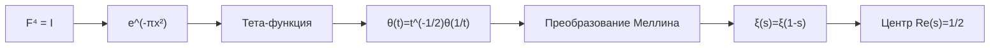
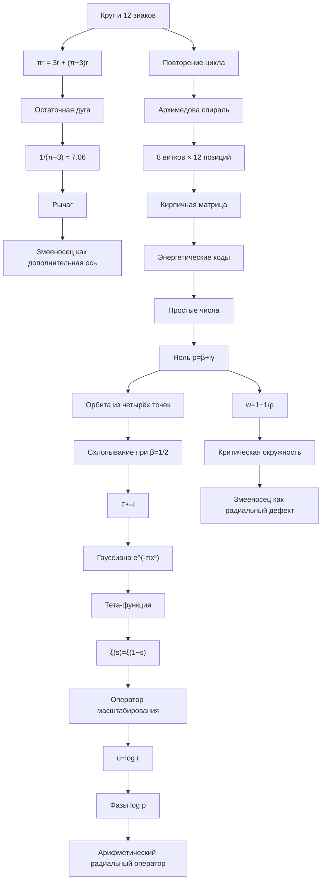

# От круга к критической линии

## Как возникла модель зодиака, остатка π, спирали, матрицы и нулей Римана

Эта работа началась не с гипотезы Римана. Я не исходил из готовой формулы и не пытался сразу доказать одну из самых сложных задач математики. Начало было намного проще: круг, радиус и вопрос о том, что именно остаётся после того, как число π разделено на целую и дробную части.

Меня заинтересовал не только сам факт иррациональности π, но и геометрический смысл его «хвоста». Если длина полуокружности равна

\[
L_{\frac12}=\pi r,
\]

а

\[
\pi=3+(\pi-3),
\]

то

\[
\pi r=3r+(\pi-3)r.
\]

Получается, что полуокружность можно представить как три радиуса и ещё одну небольшую дугу. Эта дуга равна

\[
s_\varepsilon=(\pi-3)r.
\]

Я обозначил

\[
\varepsilon=\pi-3=0.141592653589793\ldots
\]

Именно здесь возникла первая мысль всей будущей конструкции:

> В любой завершённой структуре может существовать остаток, который не является ошибкой, но показывает, что реальный объект шире его целочисленной схемы.

Эта идея сначала была только метафорой. Затем я начал искать, можно ли превратить её в геометрическую, числовую и системную модель.

---

# 1. Круг как замкнутая система

Первым объектом стал круг, разделённый на двенадцать частей.

Двенадцать естественно возникает в циклических системах:

- двенадцать месяцев;
- двенадцать знаков зодиака;
- двенадцать часов;
- двенадцать апостолов;
- двенадцать позиций завершённого цикла;
- деление окружности на участки по \(30^\circ\).

Но меня интересовало не простое перечисление соответствий. Я начал смотреть на знаки как на функции процесса.

В таком представлении двенадцать позиций могут описывать:

1. начало;
2. закрепление;
3. обмен;
4. образование внутренней среды;
5. проявление центра;
6. различение и порядок;
7. отношение;
8. кризис;
9. направление;
10. структура;
11. обновление;
12. растворение и завершение.

Круг показывает возврат к началу. Однако реальный процесс редко возвращается в абсолютно ту же точку. После прохождения цикла система уже содержит опыт предыдущего оборота.

Поэтому круг начал превращаться в спираль.

---

# 2. Почему круг стал спиралью

Круг показывает повторение без изменения уровня. Спираль показывает повторение с накоплением.

Если двенадцать знаков расположить на первом витке, затем повторить их на втором, третьем и последующих витках, каждый знак снова появляется, но уже на другой высоте или другом радиусе.

Для восьми витков получается:

\[
8\cdot12=96
\]

точек.

Каждая точка получает два номера:

- локальный номер от 1 до 12;
- абсолютный номер от 1 до 96.

Например, первый знак повторяется в точках:

\[
1,\ 13,\ 25,\ 37,\ 49,\ 61,\ 73,\ 85.
\]

Так возникли три направления чтения:

- по кругу — последовательность состояний;
- по вертикали — повтор одной функции на разных уровнях;
- по диагонали — переход между соответствиями.

Архимедова спираль задаётся формулой:

\[
r(\theta)=a+b\theta.
\]

Она удобна тем, что расстояние между витками остаётся постоянным. В моей модели:

- угол \(\theta\) означает фазу;
- радиус \(r\) означает уровень;
- оборот означает завершённый цикл;
- следующий виток означает повтор на новом уровне.

Позиции знаков можно задать так:

\[
\theta_{k,j}=2\pi k+\frac{2\pi j}{12},
\]

где \(k\) — номер витка, а \(j\) — позиция знака.

Координаты:

\[
x_{k,j}=r(\theta_{k,j})\cos\theta_{k,j},
\]

\[
y_{k,j}=r(\theta_{k,j})\sin\theta_{k,j}.
\]

Если добавить высоту:

\[
z_{k,j}=c\theta_{k,j},
\]

получается трёхмерная спираль, в которой каждый новый оборот буквально находится выше предыдущего.

---

# 3. Остаток π как скрытый сектор

Затем я вернулся к остатку:

\[
\varepsilon=\pi-3.
\]

Он соответствует углу

\[
\theta_\varepsilon=\pi-3
\]

радиан.

В градусах:

\[
\theta_\varepsilon\approx8.11^\circ.
\]

Для полной окружности остаток удваивается:

\[
2\pi-6=2(\pi-3),
\]

что соответствует примерно

\[
16.23^\circ.
\]

Так возник образ дополнительного сектора.

Но это не обычная тринадцатая равная часть круга. Если разделить круг на тринадцать равных частей, каждая будет равноправной. Остаток π устроен иначе: он возникает как разница между целочисленной моделью и настоящей окружностью.

Поэтому Змееносец стал пониматься не как ещё один знак в том же ряду, а как:

- остаточная фаза;
- скрытый переход;
- дополнительная координата;
- нарушение идеального замыкания;
- показатель выхода за пределы двенадцатичленной структуры.

Это авторская интерпретация, а не правило классической астрономии. Но она дала важный принцип:

> Змееносец — не новая равная ячейка, а мера выхода системы за пределы собственной разметки.

---

# 4. Радиус, остаток и появление семёрки

Если сравнить радиус и остаточную дугу:

\[
\frac{r}{(\pi-3)r}
=
\frac1{\pi-3}.
\]

Численно:

\[
\frac1{\pi-3}
\approx7.0625133059.
\]

Радиус примерно в семь раз длиннее остаточной дуги полуокружности.

Отсюда естественно возникает приближение:

\[
\pi\approx3+\frac17=\frac{22}{7}.
\]

Внутри модели это стало похоже на рычаг:

- длинное плечо — \(r\);
- короткое плечо — \((\pi-3)r\);
- отношение плеч — примерно \(7:1\).

Это математически корректное отношение длин. Но оно не является самостоятельным законом физики. Рычаг здесь является выбранной нами конструкцией.

Тем не менее семёрка стала подсказкой для следующего уровня:

- семь уровней;
- семь или восемь витков;
- отношение порядка к остатку;
- вертикальное развитие двенадцатичленного цикла.

---

# 5. Почему спираль была разложена в матрицу

Спираль хорошо показывает движение, но плохо подходит для сравнения большого количества соответствий.

Поэтому я мысленно разрезал её после каждого оборота и выпрямил витки в строки.

Получилась матрица:

\[
8\times12.
\]

Каждая строка — виток. Каждый столбец — знак.

Затем строки были смещены, как кирпичная кладка. Это позволило задавать правило соответствия:

\[
j_{k+1}=j_k+d\pmod{12},
\]

где \(d\) — шаг сдвига.

Если \(d=0\), знак соответствует себе на следующем уровне.

Если \(d=1\), соответствие сдвигается на один знак.

Если \(d=-1\), движение идёт в обратную сторону.

Так матрица стала не просто изображением, а прототипом вычислительной структуры. В ней можно:

- хранить уровни;
- искать вертикальные повторения;
- строить диагональные связи;
- назначать апостолов;
- назначать руны;
- связывать символы;
- сравнивать разные модели;
- отмечать степень уверенности.

---

# 6. Переход к энергетическим кодам

Сначала хотелось просто определять:

- знак;
- апостола;
- руну;
- планету.

Но быстро возникло противоречие. Один текст может использовать образы Рыб, но выполнять функцию Тельца. Он может говорить о космосе, растворении и смерти, но в основе содержать строительство устойчивой опоры.

Поэтому стало необходимо разделить:

- образ;
- функцию;
- состояние;
- свет;
- тень;
- направление перехода.

Так появилась идея энергетического кода.

Вместо независимого выбора нескольких элементов система должна выбирать один код:

```yaml
energy_code: 02
zodiac: Телец
apostle: Иоанн Богослов
planet: Венера
element: Земля
```

Это важно не только символически, но и технически. В будущей базе данных знак, апостол и руна не должны выбираться случайно и противоречить друг другу.

---

# 7. Как возникла связь с простыми числами

Переход к гипотезе Римана начался с вопроса:

> Если простые числа выглядят случайными, может ли их порядок быть не линейным, а фазовым, круговым или спиральным?

Гипотеза Римана относится к нетривиальным нулям дзета-функции:

\[
\zeta(s).
\]

Нетривиальный нуль записывается:

\[
\rho=\beta+i\gamma.
\]

Гипотеза утверждает:

\[
\beta=\frac12
\]

для каждого нетривиального нуля.

То есть все нули должны лежать на линии:

\[
\operatorname{Re}s=\frac12.
\]

Меня заинтересовало, почему именно \(1/2\), и можно ли понять эту величину не только как координату, но как состояние равновесия.

---

# 8. Ноль превращается в четыре

Если

\[
\rho=\beta+i\gamma
\]

является нулём, то из симметрий возникают:

\[
\rho,
\qquad
\overline\rho,
\qquad
1-\rho,
\qquad
1-\overline\rho.
\]

В общем случае это четыре точки.

Так образ

\[
0\longrightarrow4
\]

получил буквальный математический смысл.

Если

\[
\beta=\frac12,
\]

то:

\[
1-\overline\rho=\rho,
\]

\[
1-\rho=\overline\rho.
\]

Четыре точки схлопываются в две:

\[
\frac12+i\gamma,
\qquad
\frac12-i\gamma.
\]

Гипотезу Римана можно сформулировать геометрически:

> Все четырёхточечные орбиты нетривиальных нулей должны схлопнуться на центральную ось симметрии.

Здесь модель перестала быть чистой метафорой. Это точное следствие известных симметрий функции.

---

# 9. Почему число четыре привело к Фурье

После этого возник вопрос: где ещё существует четырёхтактный цикл возвращения?

Для нормированного преобразования Фурье:

\[
F^2f(x)=f(-x).
\]

Следовательно:

\[
F^4=I.
\]

Система проходит:

\[
F^0\rightarrow F^1\rightarrow F^2\rightarrow F^3\rightarrow F^4=I.
\]

Четвёрка стала обозначать:

- четыре симметричных нуля;
- четыре состояния преобразования;
- полный цикл вращения;
- возвращение к исходной функции.

---

# 10. Где π становится фундаментальным

Особая функция преобразования Фурье:

\[
g(x)=e^{-\pi x^2}.
\]

При правильной нормировке:

\[
Fg=g.
\]

Здесь π работает целиком. Оно не раскладывается на 3 и остаток.

Периодизация гауссиан приводит к тета-функции:

\[
\theta(t)=
\sum_{n\in\mathbb Z}e^{-\pi n^2t}.
\]

Из формулы Пуассона:

\[
\theta(t)=t^{-1/2}\theta(1/t).
\]

Преобразование Меллина переводит эту симметрию в функциональное уравнение:

\[
\xi(s)=\xi(1-s),
\]

где

\[
\xi(s)=
\frac12s(s-1)\pi^{-s/2}
\Gamma\left(\frac{s}{2}\right)\zeta(s).
\]

Получилась цепочка:



На этом этапе стало ясно:

> В архитектуре дзета-функции фундаментален полный коэффициент π. Остаток π−3 имеет геометрический смысл, но не заменяет π в функциональном уравнении.

---

# 11. Радиус как оператор масштабирования

Следующий шаг возник из вопроса о радиусе.

Если рассматривать масштабирование:

\[
r\mapsto ar,
\]

то на функциях можно определить:

\[
(U_af)(r)=a^{1/2}f(ar).
\]

Генератор этого масштабирования:

\[
D=
-i\left(
r\frac{d}{dr}
+\frac12
\right).
\]

Его обобщённые собственные функции:

\[
f_t(r)=r^{-1/2+it}.
\]

Проверка:

\[
Df_t=tf_t.
\]

Выражение

\[
\frac12+it
\]

возникает естественно как спектральная структура генератора масштабирования.

Это стало важным переходом. Величина \(1/2\) перестала быть только линией на комплексной плоскости. Она появилась как вес, необходимый для нормировки масштабирования.

---

# 12. Логарифмический радиус

После замены:

\[
u=\log r
\]

масштабирование:

\[
r\mapsto ar
\]

становится переносом:

\[
u\mapsto u+\log a.
\]

Функция

\[
r^{-1/2+it}
\]

переходит в:

\[
e^{-u/2}e^{itu}.
\]

То есть в затухающую комплексную волну.

Так радиус, частота и спираль объединились:

- \(r\) — масштаб;
- \(u=\log r\) — линейная координата масштаба;
- \(t\) — спектральная частота;
- \(1/2\) — вес нормировки;
- комплексная фаза — вращение.

---

# 13. Простые числа как вращающиеся векторы

Для области абсолютной сходимости:

\[
-\frac{\zeta'(s)}{\zeta(s)}
=
\sum_p
\sum_{m=1}^{\infty}
(\log p)p^{-ms}.
\]

Если формально положить:

\[
s=\frac12+it,
\]

отдельный член имеет вид:

\[
(\log p)p^{-m/2}e^{-itm\log p}.
\]

Это можно представить как комплексный вектор.

Амплитуда:

\[
R_{p,m}=(\log p)p^{-m/2}.
\]

Фаза:

\[
\varphi_{p,m}(t)=-tm\log p.
\]

Так возникла точная версия идеи:

> Простые числа можно воспринимать как систему радиусов и вращающихся фаз.

Логарифмы простых становятся длинами:

\[
\log p,\quad2\log p,\quad3\log p,\ldots
\]

Но есть важное ограничение: исходный ряд напрямую сходится только при

\[
\operatorname{Re}s>1.
\]

На критической линии картину нужно понимать через аналитическое продолжение, сглаживание или явные формулы.

---

# 14. Проверка связи остатка π с первым нулём

Из остатка получается:

\[
\frac2{\pi-3}
\approx14.1250266119.
\]

Первый нуль имеет высоту:

\[
\gamma_1
\approx14.1347251417.
\]

Разница:

\[
\gamma_1-\frac2{\pi-3}
\approx0.00969853.
\]

Совпадение очень близкое.

Но следующий шаг показывает:

\[
\frac3{\pi-3}
\approx21.1875399178,
\]

а

\[
\gamma_2
\approx21.0220396388.
\]

Далее:

\[
\frac4{\pi-3}
\approx28.2500532237,
\]

тогда как:

\[
\gamma_3
\approx25.0108575801.
\]

Закон быстро разрушается.

Следовательно:

\[
\gamma_n\neq\frac{n+1}{\pi-3}
\]

как общая формула.

Правильный вывод:

> Остаток π−3 случайно оказывается близок к масштабу первого нуля, но не задаёт последовательность нулей.

Это важный урок метода: красивое совпадение должно проверяться на продолжении, а не объявляться законом после первого примера.

---

# 15. Критическая линия превращается в окружность

Рассмотрим преобразование:

\[
w=1-\frac1\rho.
\]

Условие

\[
|w|=1
\]

равносильно:

\[
|\rho-1|=|\rho|.
\]

Это означает, что точка \(\rho\) равноудалена от 0 и 1.

Геометрическое место таких точек:

\[
\operatorname{Re}\rho=\frac12.
\]

Следовательно:

\[
\operatorname{Re}\rho=\frac12
\iff
\left|1-\frac1\rho\right|=1.
\]

Так критическая линия преобразуется в единичную окружность.

Это оказалась самой сильной точной связью с первоначальной идеей круга.

Круг здесь возникает не из зодиака и не из остатка π, а из дробно-линейного преобразования комплексной плоскости.

---

# 16. Новое значение Змееносца

После перехода к критической окружности Змееносца можно определить строже.

Введём радиальный дефект:

\[
D(\rho)=
\log\left|
1-\frac1\rho
\right|.
\]

Если нуль находится на критической линии:

\[
D(\rho)=0.
\]

Если он отклонён:

\[
D(\rho)\neq0.
\]

Тогда Змееносец становится не остатком π и не тринадцатой ячейкой, а дополнительным измерением:

> Змееносец — это величина выхода точки из критического равновесия.

Это лучше соответствует исходной интуиции: то, что не входит в двенадцатичленный круг, должно проявляться не как равная часть, а как отклонение по другой оси.

---

# 17. Матрица нулей

Нули можно пронумеровать:

\[
\rho_1,\rho_2,\rho_3,\ldots
\]

и разложить по двенадцати столбцам:

\[
n=12k+j.
\]

Здесь:

- \(j\) — знак;
- \(k\) — виток;
- \(n\) — номер нуля.

В каждой ячейке можно хранить:

\[
A_{k,j}
=
\log
\left|
1-\frac1{\rho_{12k+j}}
\right|.
\]

Если гипотеза Римана истинна:

\[
A_{k,j}=0
\]

для всех ячеек.

Получается бесконечная матрица \(12\times\infty\).

Первые восемь строк содержат первые 96 позиций.

Визуально:

- столбец — знак;
- строка — виток;
- высота или цвет — дефект;
- нулевой дефект — критическая окружность;
- ненулевой дефект — выход из неё.

---

# 18. Коэффициенты Ли

Более строгую матрицу можно построить из коэффициентов Ли:

\[
\lambda_n
=
\sum_\rho
\left[
1-
\left(1-\frac1\rho\right)^n
\right].
\]

Гипотеза Римана эквивалентна условию:

\[
\lambda_n\ge0
\]

для всех натуральных \(n\).

Тогда:

\[
M_{k,j}=\lambda_{12k+j}.
\]

Гипотеза эквивалентна:

\[
M_{k,j}\ge0
\]

во всех ячейках бесконечной матрицы.

Это особенно хорошо подходит для будущего приложения:

- двенадцать столбцов;
- неограниченное число витков;
- значение в ячейке;
- визуальная проверка положительности;
- связь с доказанной эквивалентной формулировкой.

Но конечное количество положительных коэффициентов не доказывает бесконечное утверждение.

---

# 19. Гипотеза арифметического радиального оператора

Все линии исследования сошлись в одной формальной гипотезе.

## Формулировка

Существует самосопряжённый оператор \(H\), построенный на пространстве логарифмических радиусов

\[
u=\log r,
\]

такой что:

\[
\operatorname{Spec}(H)=\{\gamma_n\},
\]

где

\[
\xi\left(\frac12+i\gamma_n\right)=0.
\]

Оператор должен содержать:

### Масштабирование

\[
D=
-i\left(
r\frac{d}{dr}
+\frac12
\right).
\]

### Арифметические точки

\[
u=m\log p.
\]

### Фурье-симметрию

\[
F^4=I.
\]

### Гауссов фактор

\[
e^{-\pi r^2}.
\]

### Спектральный определитель

Желаемая форма:

\[
\det_{\mathrm{reg}}(H-t)
\propto
\Xi(t),
\]

где:

\[
\Xi(t)=
\xi\left(\frac12+it\right).
\]

Если такой оператор будет построен и доказана его самосопряжённость, его спектр будет вещественным.

Тогда:

\[
\rho_n=\frac12+i\gamma_n.
\]

Это действительно доказало бы гипотезу Римана.

---

# 20. Чего не хватает

Не хватает именно арифметической части оператора.

Простой оператор масштабирования имеет слишком регулярный спектр.

Простой оператор окружности тоже создаёт слишком регулярные собственные значения.

Обычный потенциал не воспроизводит нужную статистику автоматически.

Искомая система должна иметь периодические структуры длины:

\[
\log p,\quad2\log p,\quad3\log p,\ldots
\]

и формулу следа, совпадающую с явной формулой Римана.

То есть требуется не просто красивая геометрия, а механизм, в котором:

- простые являются периодическими орбитами;
- нули являются спектральными частотами;
- симметрия \(s\leftrightarrow1-s\) встроена в оператор;
- самосопряжённость обеспечивает реальность спектра;
- π и гамма-фактор возникают естественно;
- арифметика не добавляется искусственно.

---

# 21. Где строгая математика, а где авторская система

## Строгие элементы

1. Разложение:

\[
\pi r=3r+(\pi-3)r.
\]

2. Отношение:

\[
\frac1{\pi-3}.
\]

3. Четырёхточечная симметрия нулей.

4. Схлопывание при \(\operatorname{Re}\rho=1/2\).

5. Свойство:

\[
F^4=I.
\]

6. Фурье-инвариантность гауссианы.

7. Связь тета-функции, преобразования Меллина и функционального уравнения.

8. Оператор масштабирования.

9. Замена:

\[
u=\log r.
\]

10. Фазы:

\[
e^{-itm\log p}.
\]

11. Эквивалентность:

\[
\operatorname{Re}\rho=\frac12
\iff
|1-1/\rho|=1.
\]

12. Критерий Ли.

## Авторские элементы

1. Двенадцать столбцов как знаки зодиака.

2. Семь или восемь витков как уровни.

3. Кирпичная укладка.

4. Название «Змееносец» для остаточной или дефектной оси.

5. Соответствия знаков апостолам и рунам.

6. Интерпретация остатка π как перехода.

7. Энергетические коды.

8. Использование системы как эзотерической базы знаний.

Эти уровни нельзя смешивать. Символическая модель может направлять исследование, но доказательство должно быть независимо от символики.

---

# 22. Метод, который возник в процессе

В результате сформировался общий способ исследования.

## Шаг 1. Увидеть образ

Круг, остаток, спираль, кирпич, рычаг, четверка.

## Шаг 2. Найти математический объект

- круг → комплексная окружность;
- спираль → параметрическая кривая;
- остаток → \(\pi-3\);
- рычаг → отношение длин;
- четверка → орбита симметрий;
- радиус → масштабирование;
- вращение → комплексная фаза;
- этажи → матрица.

## Шаг 3. Проверить продолжение

Один пример не является законом.

## Шаг 4. Найти инвариант

Что сохраняется при преобразовании?

## Шаг 5. Построить эквивалентность

Например:

\[
\operatorname{Re}\rho=\frac12
\iff
|1-1/\rho|=1.
\]

## Шаг 6. Перевести идею в данные

- точки;
- номера;
- уровни;
- связи;
- формулы;
- источники;
- статусы;
- уверенность.

## Шаг 7. Визуализировать

Сначала 2D, затем 3D, затем интерактивные слои.

## Шаг 8. Искать опровержение

Если идею невозможно проверить, она остаётся метафорой.

---

# 23. Зачем понадобилась 3D-визуализация

Плоская схема не показывает все параметры одновременно.

В 3D можно разделить:

- угол;
- радиус;
- высоту;
- фазу;
- виток;
- отклонение от оси;
- отклонение от окружности.

Поэтому были созданы отдельные слои:

### Зодиакальная спираль

Показывает повторение двенадцати позиций.

### Кирпичная матрица

Показывает соответствия и сдвиги.

### Остаток π

Показывает дугу и отношение к радиусу.

### Нули

Показывает критическую ось и четверку.

### Критическая окружность

Показывает радиальный дефект.

### Фурье

Показывает четыре состояния полного цикла.

### Гауссиана

Показывает структурное место π.

### Логарифмический радиус

Показывает:

\[
r^{-1/2+it}.
\]

### Простые векторы

Показывает амплитуды и фазы \(\log p\).

Переключение слоёв необходимо, потому что эти структуры связаны не одинаковым образом. Одни связи являются теоремами, другие — эвристиками, третьи — авторскими соответствиями.

---

# 24. Связь с Obsidian и будущим приложением

Obsidian стал прототипом базы знаний.

Каждая сущность хранится отдельно:

- знак;
- апостол;
- руна;
- концепт;
- символ;
- формула;
- математический объект;
- гипотеза;
- источник;
- анализ;
- визуализация.

Связь тоже должна быть отдельной записью.

Пример авторской гипотезы:

```yaml
subject: Остаток π
predicate: интерпретируется_как
object: Змееносец
context: Авторская модель
status: hypothesis
confidence: 0.45
```

Пример строгой связи:

```yaml
subject: Критическая линия
predicate: отображается_в
object: Единичная окружность
context: w = 1 - 1/ρ
status: accepted
confidence: 1.0
```

Система должна показывать не только что связано, но и:

- почему;
- через какую формулу;
- в каком контексте;
- кто предложил;
- насколько надёжно;
- как проверить;
- какие существуют возражения.

---

# 25. Общая схема пути



---

# 26. Главный вывод

Я начинал с хвоста числа π.

Из остатка возникла реальная дуга.

Из круга возник двенадцатичленный цикл.

Из повторения возникла спираль.

Из спирали появилась матрица.

Из матрицы выросла система соответствий.

Из числа четыре возникли симметрии нулей и цикл Фурье.

Из гауссианы появилось структурное значение π.

Из радиуса возник оператор масштабирования.

Из логарифма радиуса появились частоты.

Из простых чисел возникли фазы \(\log p\).

Из критической линии появилась критическая окружность.

Змееносец постепенно изменил смысл:

1. остаточная часть круга;
2. дополнительный сектор;
3. скрытая координата;
4. радиальный дефект.

Наиболее строгая версия:

\[
D(\rho)=
\log
\left|
1-\frac1\rho
\right|.
\]

Конечная последовательность модели:

\[
\boxed{
\text{цикл}
\rightarrow
\text{спираль}
\rightarrow
\text{матрица}
\rightarrow
\text{симметрия}
\rightarrow
\text{оператор}
\rightarrow
\text{спектр}
}
\]

И содержательная формулировка:

> Нули Римана можно рассматривать как предполагаемые частоты скрытой арифметической системы масштабирования. Четвёрка задаёт симметрию преобразований, π задаёт гауссову геометрию, радиус переходит в логарифмическую координату, а простые числа входят как фазовые длины \(\log p\).

Это пока не доказательство. Это архитектура исследования.

---

# 27. Что исследовать дальше

## Спектральный оператор

Уточнить пространство, область определения и граничные условия для:

\[
D=
-i\left(
r\frac{d}{dr}
+\frac12
\right).
\]

## Арифметические возмущения

Проверить, можно ли ввести структуру в точках:

\[
u=m\log p.
\]

## Формула следа

Сопоставить предполагаемую формулу следа с явной формулой Римана.

## Критическая окружность

Изучать:

\[
D(\rho)=\log|1-1/\rho|.
\]

## Коэффициенты Ли

Построить:

\[
M_{k,j}=\lambda_{12k+j}.
\]

## Сглаженные простые фазы

Исследовать суммы вида:

\[
\sum_{p,m}
w(p^m)(\log p)p^{-m/2}e^{-itm\log p}.
\]

## База знаний

Для каждого утверждения хранить:

- определение;
- формулу;
- статус;
- источник;
- визуализацию;
- аргументы;
- контраргументы;
- численную проверку.

---

# Заключение

Смысл этой работы не в том, чтобы объявить гипотезу Римана решённой.

Смысл в переводе интуитивного образа в несколько строгих языков:

- геометрию;
- комплексный анализ;
- спектральную теорию;
- преобразование Фурье;
- логарифмические координаты;
- теорию чисел;
- структуры данных;
- интерактивную визуализацию.

Некоторые исходные догадки не выдержали проверки. Формула через \(\pi-3\) не описывает последовательность нулей.

Но эта ошибка оказалась полезной. Она заставила точнее определить:

- роль полного π;
- роль остатка;
- роль радиуса;
- роль \(1/2\);
- роль спектральной частоты;
- границу между метафорой и математикой.

В результате возникла не готовая теорема, а карта исследования.

Новая система часто начинается именно так: не с немедленного правильного ответа, а с последовательного уточнения образа, пока из него не выделяются проверяемые конструкции.
